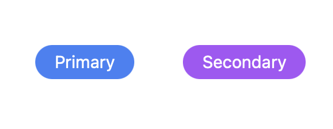
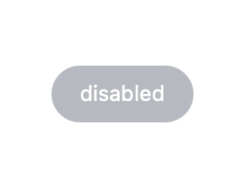
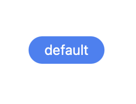

### Tailwind Variants とは

同じコンポーネントだが、条件などによって異なるスタイルを持たせることのできるライブラリ

<br>

例: ボタンコンポーネントが条件によって clickable / disable になるケースがよくある

-> Tailwaind Variants を使えば、 1つのボタンコンポーネントファイルにたいし、 clickable と disable のスタイルを持たせることができる

---

### 準備

インストール

```bash
npm install tailwind-variants
```

<br>

利用したいコンポーネントファイルにてインポート

```js
// component.tsx
import { tv } from 'tailwind-variants';
```

---

### 基本的な使い方

わかりやすい参考サイト: [Tailwind Variantsに触れてみる](https://zenn.dev/yend724/articles/20230603-wgnqrgmj8kymzpev)

公式サイト: [Variants](https://www.tailwind-variants.org/docs/variants)

```js
// component.tsx
import { tv } from 'tailwind-variants';

const btnStyle = tv({

    // base: 共通となるスタイル
        base: 'text-white text-sm py-1 px-4 rounded-full',

    /**
     * variants: {
     *     keyName: {
     *         state1: 'styles',
     *         state2: 'styles'
     *     }
     * }
    */
        variants: {
            color: {
                primary: 'bg-blue-500 hover:bg-blue-700',
                secondary: 'bg-purple-500 hover:bg-purple-700'
            }
        }
    }
});


// 実際にクラスを付与するには、 tv()の結果(関数)を代入した変数を呼び出す
// variantsを設定した場合は引数に {key: value}を渡す
const primaryBtn = () => {
    return <button className={ btnStyle({color: 'primary'}) }>Primary</button>
}

const secondaryBtn = () => {
    return <button className={ btnStyle({color: 'secondary') }></button>
}

export { primaryBtn, secondaryBtn };
```



<br>
<br>

複数の variants を設定することもできる (色とサイズなど)

```ts
import { tv } from 'tailwind-variants';

const btnStyle = tv({
    base: 'text-white text-sm py-1 px-4 rounded-full',
    variants: {
        color: {
            primary: 'bg-blue-500',
            secondary: 'bg-purple-500'
        },
        size: {
            small: 'text-xs',
            medium: 'text-sm',
            large: 'text-md'
        }
    }
});

const primarySmall = () => {
    return <button className{ btnStyle({color: 'primary', size: 'small'})} >Primary-S</button>;
};

const secondaryLarge = () => {
    return <button className={ btnStyle({color: 'secondary', size: 'large'}) }>Secondary-L</button>
}
```

*base で既にtextのサイズは指定されているが、variants で指定されているテキストサイズに上書きされる

= base と variatns にて同じスタイル項目が設定されている場合、 variants 設定の方が優先される


<br>
<br>

variants　項目に boolean 値を設定することもできる

```js
import { tv } from 'tailwind-variants';

const btnStyle = tv({
    base: 'text-white text-sm py-1 px-4 rounded-full',
    variants: {
        size: {
            small: 'text-xs',
            medium: 'text-sm',
            large: 'text-md'
        },
        disable: {
            true: 'bg-gray-500 pointer-events-none',
        }
    }
});

const disableBtn = () => {
    return <button className={ btnStyle({size: "small", disable: true}) }>disabled</button>
};
```



---

### デフォルトのスタイルを作成する

イメージ

```js
const style = tv({ ~~ });

// 単純に style() の引数なしでデフォルトのスタイルを適用できるようにする
const component = () => {
    return <div className={ style() }></div>
}
```

<br>
<br>

tv() に渡すオブジェクトに defaultVariants プロパティを追加する

```js
import { tv } from 'tailwind-variants';

const btn = tv({
    base: 'text-white text-sm py-1 px-4 rounded-full',
    variants: {
        color: {
            primary: 'bg-blue-500',
            secondary: 'bg-purple-500'
        },
        size: {
            small: 'text-xs',
            medium: 'text-sm',
            large: 'text-md'
        }
    },
    // デフォルトの color と size を指定する
    defaultVariants: {
        color: 'primary',
        size: medium
    }
});

const defaultBtn = () => {
    return <button className={ btn() }>default</button>
}
```



---

### レスポンシブ対応

*事前準備が必要

Tailwind 設定ファイル (tailwind.config.js) を Tailwind Variants wrapper で囲む必要がある

```js
// tailwind.config.js
const { withTV } = require('tailwind-variants/transformer');
 
/** @type {import('tailwindcss').Config} */
module.exports = withTV({
  content: ['./index.html', './src/**/*.{js,ts,jsx,tsx}'],
  theme: {
    extend: {}
  },
  plugins: []
});
```

<br>
<br>

画面のサイズによってボタンの色とフォントサイズを変更する

tv 関数の引数のオブジェクトに responsiveVariants プロパティを追加する

responsiveVariants プロパティの値は TailwindCSS のブレイクポイントキーワード

```js
import { tv } from 'tailwind-variants';

const btn = tv({
    base: 'text-white text-sm py-1 px-4 rounded-full',
    variants: {
        color: {
            blue: 'bg-blue-500',
            purple: 'bg-purple-500',
            green: 'bg-green-500'
        },
        text: {
            small: 'text-xs',
            medium: 'text-base',
            large: 'text-lg'
        },
        // 値は配列であることに注意
        responsiveVariants: ["sm", "md"] // TailwindCSSのブレイクポイント
    }
});

/**
 * 画面サイズが"sm"の時は
 *     - 色: 紫
 *     - 文字サイズ: 普通
 * 
 * "md"の時は
 *     - 色: 緑
 *     - 文字サイズ: 大きい
 * 
 * それ以外のときは
 *     - 色: 青
 *     - 文字サイズ: 小さい
 */
const Button = () => {
    return <button className={
        color: {
            initial: 'blue',
            sm: 'purple',
            md: 'green'
        },
        size: {
            initial: 'small',
            sm: 'medium',
            md: 'large'
        }
    }></button>
};
```

